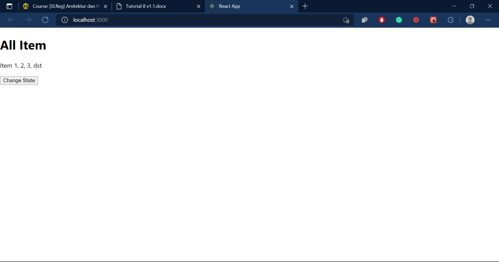

# Tutorial APAP
## Authors
* **Afnadiati Hartatika** - *1906398931* - *C*
---
## Tutorial 8
### What I have learned today

### Pertanyaan
1. Ceritakan langkah - langkah yang kalian lakukan untuk solve LATIHAN no.1, dan mengapa kalian
   melakukan langkah - langkah tersebut?
   Pada latihan no. 1, saya menambahkan metode configure() lain yang memiliki parameter WebSecurity di file WebSecurityConfig pada backend app sebagai berikut:
   
   `@Override
   public void configure(WebSecurity web) throws Exception {
       web.ignoring().antMatchers("/api/**");
   }`
   
   Method tersebut ditambahkan untuk membuat form Add Item yang telah disubmit dapat ter-reset seperti default form sebelumnya.

3. Jelaskan fungsi dari async dan await!
   Async dan await adalah sebuah syntax khusus yang digunakan untuk berkolaborasi dengan Promise agar program dapat lebih mudah untuk digunakan. Async adalah fungsi yang dapat mengembalikan sebuah Promise. Sedangkan, Await adalah fungsi yang hanya dapat berjalan di dalam sebuah Async, jika tidak ada Async maka Await tidak dapat digunakan. Await digunakan agar dapat menunda jalannya Async sampai proses dari Await selesai dan berhasil dieksekusi.

3. Masukkan jawaban dari Screenshot yang diperintahkan di halaman 9 pada Component Lifecycle
   pada pertanyaan ini.
   - 
   - 
   - 
   - 
   - 
   - 
   - 
   - 
   - 
   - 

4. Jelaskan fungsi dari componentDidMount, shouldComponentUpdate,
   componentDidUpdate, componentWillReceiveProps, componentWillUnmount.
   Notes : Penjelasan harus mencantumkan “kapan fungsi dipanggil” dan “use case apa saja
   yang biasanya menggunakan lifecycle method tersebut”.
   - componentDidMount digunakan untuk memuat data dari titik akhir jarak jauh untuk membuat instance network request, dipanggil saat setelah komponen dipasang.
   - shouldComponentUpdate digunakan untuk memberi tahu ke React bahwa output komponen tidak terpengaruh dengan perubahan state atau property saat itu. Ia akan merender ulang setiap perubahan status yang terjadi secara default. shouldComponentUpdate dipanggil sebelum melakukan render ketika terdapat new props atau state yang sedang diterima.
   - componentDidUpdate dipanggil saat terjadi pebaruan untuk melakukan render di awal. Digunakan untuk mengoperasikan DOM ketika komponen telah diperbarui.
   - componentWillReceiveProps dipanggil sebelum komponen yang dipasang meneripa props yang baru. Method ini akan dipanggil walaupun props tidak berubah.
   - componentWillUnmount dipanggil saat komponen dihapus dari DOM. Perlu dilakukan pembersihan saat method ini dipanggil, seperti canceling network request, dsb.

### References:

- https://www.kawankoding.id/javascript-async-await/
- https://reactjs.org/docs/react-component.html

---
## Tutorial 7
### What I have learned today

### Pertanyaan
1. Jelaskan apa yang Anda lakukan di latihan dalam satu paragraf per-soal. Berikan screenshot
   sebagai ilustrasi dari apa yang Anda jelaskan.
   - Latihan 1: Mengaktifkan tombol delete.
      
      Pada latihan ini, saya membuat function baru bernama "handleDeleteItemFromCart" yang berfungsi untuk menghapus item yang dipilih dari keranjang. Di awal didefinisikan terlebih dahulu beberapa variabel yang akan digunakan. Terdapat variable "newItems" yang mendefinisikan kumpulan item yang telah dimasukkan ke keranjang dan disimpan ke dalam sebuah array, variable "newItem" mendefinisikan sebuah item yang dipilih, variable "targetInd" mendefinisikan kumpulan item yang sudah dipilih, dan balance mendeskripsikan jumlah balance saat itu. Saat item terpilih dan dimasukkan ke dalam keranjang, setiap item akan memiliki tombol delete yang diaktifkan dengan memberikan action pada "onItemClick" di MyCart. Setelah itu akan dijalankan function "handleDeleteItemFromCart". Item yang dipilih akan dicek pada array keranjang, jika item tersebut berada di keranjang maka statusnya di dalam keranjang akan diubah menjadi "false" yang menandakan bahwa item tersebut dihapus. Lalu, item tersebut dihapus dari array newItems dan dilakukan update pada Shop Item yang berarti item tersebut telah dijual kembali. Kemudian, status balance dikembalikan dengan cara menambahkan balance saat ini dengan price dari item yang dihapus.
      
      
   - Latihan 2: Mengurangi total balance sesuai dengan harga item yang ada di keranjang.
   
      Pada latihan ini, saya mengimplementasikannya di function "handleAddItemToCart". Saat sebuah item dipilih untuk dimasukkan ke keranjang, akan menjalankan function add. Jika item berhasil ditambahkan ke keranjang, maka total balance saat ini dikurangkan dengan harga item yang sedang ditambah tersebut. Maka nilai balance akan terupdate menjadi berkurang.
       
  - Latihan 3

      Pada latihan ini, saya mengimplementasikannya di function "handleAddItemToCart". Di function tersebut dibuat terlebih dahulu kondisi jika nilai balance lebih dari harga item yang ditambahkan, maka item tersebut dapat ditambahkan. Jika nilai balance tidak mencukupi, maka akan beralih ke kondisi else yang mengeksekusi "alert" dan memberikan notifikasi bahwa balance tidak mencukupi.
      

2. Menurut pemahaman kamu selama pengerjaan tutorial ini, apa perbedaan antara state dan
   props?
   - State merupakan data private dari sebuah component yang hanya tersedia untuk component tersebut dan tidak dapat diakses dari luar component itu. State biasanya digunakan untuk menangani data yang sifatnya dapat berubah-ubah. 
   - Prop adalah singkatan dari Property, Prop digunakan untuk melakukan komunikasi data component dari parent ke child dari component tersebut. Prop bersifat read only.
   - Perbedaan dari keduanya yaitu state hanya dapat dimiliki oleh class component, sedangkan functional component dapat mengandung prop saja.

3. Menurut kamu, apakah sebaiknya kita menggunakan component (e.g. List, Item) dalam
   React? sebutkan alasannya.
   
   Ya, sebaiknya menggunakan component karena aplikasi react tersusun dari beberapa component.
   Component digunakan untuk memperintahkan react hal-hal yang harus ditampilkan ke real DOM dalam bentuk HTML.

4. Apa perbedaan class component dan functional component?
   - Class component dapat menggunakan state dan props, seringkali disebut statefull.
   - Functional component biasa digunakan untuk membangun tampilan UI, hanya dapat menggunakan props sehingga biasa
      disebut stateless component. Functional component memiliki syntax yang lebih simple.

5. Dalam react, apakah perbedaan component dan element?
   - Component merupakan bagian-bagian kecil dari aplikasi. Component yang terkandung di dalam component yaitu User Interface dan Data.
   - Element merupakan blok bangunan terkecil di aplikasi.
   - Kumpulan element dapat membentuk suatu componen atau dengan kata lain component terdiri dari beberapa element.

### References:

- https://medium.com/coderupa/react-prop-state-apa-bedanya-7ee61df8257f
- https://www.petanikode.com/reactjs-komponen/
- https://hobikoding.github.io/component-react/

---
## Tutorial 6
### What I have learned today

### Pertanyaan
1. Jelaskan secara singkat perbedaan Otentikasi dan Otorisasi! Di bagian mana (dalam kode yang telah anda buat) konsep tersebut diimplementasi?
   Otentikasi merupakan proses identifikasi data pengguna, sedangkan otorisasi proses penentuan apakah seorang user dapat mengakses suatu resources atau tidak.
   - Otentikasi -> proses login/logout.
   - Otorisasi -> saat hanya seorang pengguna dengan role manager yang dapat mengubah, menambahkan dan menghapus penjaga.

2. Apa itu BCryptPasswordEncoder? Jelaskan secara singkat cara kerja dan tujuannya.
   Bcrypt berfungsi untuk menghashing password user menjadi potongan kode yang tidak dapat dibaca oleh pengguna lain.
   Tujuannya untuk melindungi keamanan akun pengguna, agar password tidak mudah dicuri.

3. Apakah penyimpanan password sebaiknya menggunakan encryption atau hashing? Mengapa
   demikian?
   Sebaiknya menggunakan keduanya, hashing membantu untuk mengamankan password dari database owner. Sedangkan, encryption dapat melindungi data dengan lebih aman.
   

4. Jelaskan secara singkat apa itu UUID beserta penggunaannya!
   UUID adalah alat pengidentifikasian unique identifier yang dibuat dengan menggunakan timestamp dan alamat MAC komputer si pembuat.
   

5. Apa kegunaan class UserDetailsServiceImpl.java? Mengapa harus ada class tersebut?
   Berguna untuk membangun otentikasi user.

### References:

- https://www.akakom.ac.id/site/news/124/autentikasi-dan-otorisasi-user-menggunakan-framework-yii
- https://www.uuidgenerator.net

---
## Tutorial 5
### What I have learned today

### Pertanyaan
1. Apa itu Postman? Apa kegunaannya?
   Postman merupakan sebuah aplikasi yang memiliki fungsi sebagai REST CLIENT
   untuk melakukan uji coba REST API. Postman seringkali digunakan untuk menguji API
   yang dibuat oleh para developer pembuat API.

2. Jelaskan fungsi dari anotasi @JsonIgnoreProperties dan @JsonProperty.
   - @JsonIgnoreProperties digunakan untuk mengabaikan properti-properti yang telah ditentukan
      menjadi lebih mudah untuk dilihat dan dibaca.
   - @JsonProperty digunakan untuk mengganti nama suatu bidang/properti.
   

3. Apa kegunaan atribut WebClient?
   
   WebClient berfungsi untuk merender halaman web yang diterima dari server.

4. Apa itu ResponseEntity dan BindingResult? Apa kegunaannya?
   - ResponseEntity adalah perwakilan dari seluruh response HTTP.
   - BindingResult berperan sebagai argumen untuk memvalidasi suatu kesalahan pada objek.
   

### References:

- https://antares.id/id/postman.html
- https://ichi.pro/id/menggunakan-anotasi-jackson-dengan-jackson-jr-89096820144478
- https://view.officeapps.live.com/op/view.aspx?src=https%3A%2F%2Ftugas2kampus.files.wordpress.com%2F2013%2F11%2Fkomplit-modul1.docx&wdOrigin=BROWSELINK
- https://www.it-swarm-id.com/id/spring/saat-menggunakan-responseentity-t-dan-restcontroller-untuk-aplikasi-spring-restful/1049152939/#:~:text=ResponseEntity%20dimaksudkan%20untuk%20mewakili%20seluruh,menyatakan%20kode%20status%20respons%20HTTP.
- https://answer-id.com/id/53849947

---
## Tutorial 4
### What I have learned today

### Pertanyaan
1. Jelaskan perbedaan th:include dan th:replace!
   - th:include adalah cara untuk memasukkan konten dari sebuah fragment tetapi tidak menyisipkan tag fragment itu sendiri.
   - th:replace adalah cara untuk memasukkan konten dari sebuah fragment dengan mengganti tag saat ini dengan tag yang 
     mendefinisikan fragment tersebut.
   

2. Jelaskan apa fungsi dari th:object!
   
   th:object berfungsi sebagai penentu objek yang akan di submit dalam sebuah data formulir yang dikirimkan. 
   Setiap field data formulir dipetakan menggunakan atribut th:field="*{name}", name tersebut mendefinisikan properti 
   objek yang sesuai dengan field.
   

3. Jelaskan perbedaan dari * dan $ pada saat penggunaan th:object! Kapan harus dipakai?
   - tag dengan tanda * digunakan untuk mengisi field data dari formulir, biasanya diterapkan pada formulir edit dan input.
   - tag dengan tanda $ menandakan bahwa tag tersebut merepresentasikan suatu objek atau variabel dari sebuah kumpulan data, 
     biasanya digunakan untuk mengambil nilai yang akan ditampilkan pada template html.

### What I did not understand
- [ ] Kategorisasi penggunaan masing-masing tag Thymeleaf

### References:

- https://www.baeldung.com/spring-thymeleaf-fragments
- https://www.baeldung.com/thymeleaf-in-spring-mvc
- https://www.sinaungoding.com/yuk-belajar-web-menggunakan-spring-boot2/
- https://anshulgnit.blogspot.com/2018/05/difference-between-thymeleaf-attribute-replace-insert-and-include.html

---
## Tutorial 3
### What I have learned today

### Pertanyaan
1. Tolong jelaskan secara singkat apa kegunaan dari anotasi-anotasi yang ada pada model
   (@AllArgsConstructor, @NoArgsConstructor, @Setter, @Getter, @Entity, @Table)
   - @AllArgsConstructor: membuat constructor dengan menggunakan argumen.
   - @NoArgsConstructor: membuat constructor tanpa menggunakan argumen.
   - @Setter: menghasilkan fungsi setter.
   - @Getter: menghasilkan fungsi getter.
   - @Entity: mendefinisikan nama entity dari class.
   - @Table: menetapkan nama tabel SQL.
   

2. Pada class BioskopDB, terdapat method findByNoBioskop, apakah kegunaan dari method
   tersebut?

   Method findByNoBioskop berfungsi sebagai interface yang akan menghubungkan method 
   implementasinya pada file BioskopServiceImpl dengan database. Method tersebut digunakan
   untuk mencari semua bioskop berdasarkan nomornya.

3. Jelaskan perbedaan kegunaan dari anotasi @JoinTable dan @JoinColumn.

   @JoinTable melakukan penyimpanan id dari kedua entity ke dalam tabel terpisah, 
   sedangkan @JoinColumn melakukan penyimpanan id entity lain di kolom baru dengan table yang sama.

4. Pada class PenjagaModel, digunakan anotasi @JoinColumn pada atribut bioskop, apa
   kegunaan dari name, referencedColumnName, dan nullable dalam anotasi tersebut? dan apa
   perbedaan nullable dan penggunaan anotasi @NotNull.
   - name: nama dari kolom foreign key.
   - referencedColumnName: nama kolom yang dirujuk oleh foreign key.
   - nullable: menentukan kondisi apakah kolom foreign dapat tidak memiliki nilai atau tidak.
   - @NotNull: field yang memiliki karakteristik @NotNull form tidak boleh dikosongkan, tetapi fieldnya bisa kosong. 

5. Jelaskan kegunaan FetchType.LAZY, CascadeType.ALL, dan FetchType.EAGER.

   FetchType.LAZY digunakan saat persistence provider runtime harus bekerja dengan cepat, sedangkan FetchType.LAZY
   digunakan saat persistence yang bekerja tidak memerlukan kerja keras atau dapat diproses perlahan-lahan.
   Penggunaan CascadeType.ALL berarti bahwa setiap perubahan yang terjadi pada suatu entity akan mempengaruhi 
   (atau ikut berubah) entity lain yang memiliki relasi dengannya.

### What I did not understand
- [ ] Kapan waktu yang tepat untuk menggunakan repository? 
- [ ] Perbedaan model dengan DB

### References:
- http://www.intelligentprogrammer.com/index.php/2021/01/01/how-to-use-lombok-in-spring-boot/
- https://www.baeldung.com/jpa-entity-table-names
- https://javakeypoint.wordpress.com/2020/04/21/difference-between-joincolumn-and-jointable-in-hibernate/
- https://docs.oracle.com/javaee/6/api/javax/persistence/JoinColumn.html
- https://www.baeldung.com/java-bean-validation-not-null-empty-blank
- https://atautowired.wordpress.com/2013/05/08/fetchtype-lazy-vs-fetchtype-eager-in-javax-persistance/
- https://howtodoinjava.com/hibernate/hibernate-jpa-cascade-types/

---
## Tutorial 2
### What I have learned today

### Pertanyaan
1. Cobalah untuk menambahkan sebuah Bioskop dengan mengakses link berikut: http://localhost:8080/bioskop/add?idBioskop=1&namaBioskop=Bioskop%20PAPA%20APAP&alamat=Maung%20Fasilkom&noTelepon=081xxx&jumlahStudio=10 Apa yang terjadi? Jelaskan mengapa hal tersebut dapat terjadi 
   
    Jawab: Tidak dapat diakses atau terjadi *Whitelable Error Page*, karena view template yang diimplementasikan yaitu **"add-bioskop"** pada Controller belum dibuat.

2. Menurut kamu anotasi @Autowired pada class Controller tersebut merupakan implementasi dari konsep apa? Dan jelaskan secara singkat cara kerja @Autowired tersebut dalam konteks service dan controller yang telah kamu buat
   
    Jawab: @Autowired merupakan fitur component-scan yang disediakan oleh Spring Framework. @Autowired bekerja dengan melihat isi package dan mencari class-class yang memiliki anotasi tertentu seperti @Repository, @Service, @Controller, dan @Component. Setelah class-class tersebut ditemukan, lalu dilakukan inject untuk semua dependency tanpa perlu menyediakan setter, getter, dan constuctor. Pada Lab kali ini @Autowired diimplementasikan sebagai Controller.

3. Cobalah untuk menambahkan sebuah Bioskop dengan mengakses link berikut: http://localhost:8080/bioskop/add?idBioskop=1&namaBioskop=Bioskop%20PAPA%20APAP&alamat=Maung%20Fasilkom&noTelepon=081xxx Apa yang terjadi? Jelaskan mengapa hal tersebut dapat terjadi.
   
   Jawab: Link tersebut tidak dapat bekerja, karena kekurangan parameter yaitu jumlah studio yang wajib diisi belum dimasukkan, sehingga link gagal dieksekusi.

4. Jika Papa APAP ingin melihat Bioskop dengan nama Bioskop Maung,
   link apa yang harus diakses?

   Jawab: Diasumsikan bioskop dengan nama Bioskop Maung memiliki ID = 1, sehingga dapat diakses pada link berikut http://localhost:8080/bioskop/view?idBioskop=1

5. Tambahkan 1 contoh Bioskop lainnya sesukamu. Lalu cobalah untuk mengakses http://localhost:8080/bioskop/viewall , apa yang akan ditampilkan? Sertakan juga bukti screenshotmu.

   Jawab:
   
   Link untuk penambahan data: http://localhost:8080/bioskop/add?idBioskop=2&namaBioskop=Bioskop%20AKU&alamat=Depok%20Fasilkom&noTelepon=081xxx&jumlahStudio=20
   
   Halaman daftar bioskop
   

### Latihan
1. Pada BioskopController tambahkan sebuah method view Bioskop dengan menggunakan Path
   Variable. Misalnya, kamu ingin memasukkan data sebuah Bioskop yang memiliki idBioskop
   1, untuk melihat data yang baru dimasukkan tersebut, user dapat mengakses halaman
   http://localhost:8080/bioskop/view/id-bioskop/1.
   
   

2. Tambahkan fitur untuk melakukan update jumlahStudio Bioskop berdasarkan idBioskop.
   Misalnya, setelah melakukan add Bioskop pada tahap 1 bab View Template, cobalah untuk
   mengubah jumlahStudio objek Bioskop tersebut menjadi 999 dengan mengakses halaman
   http://localhost:8080/bioskop/update/id-bioskop/1/jumlah-studio/999
   Tampilkan juga sebuah halaman yang memberikan informasi bahwa data tersebut telah
   berhasil diubah.
   
   

3. Tambahkan fitur untuk melakukan delete Bioskop berdasarkan idBioskop. Misalnya, setelah
   melakukan add Bioskop pada tahap 1 bab View Template dan melakukan update seperti pada
   latihan nomor 2, cobalah untuk melakukan delete data tersebut dengan mengakses halaman
   http://localhost:8080/bioskop/delete/id-bioskop/1. Tampilkan sebuah halaman yang
   memberikan informasi bahwa data tersebut telah berhasil dihapus.
   
   

### What I did not understand
- [ ] Perbedaan dari masing-masing MVC 
- [ ] Waktu yang tepat untuk menggunakan MVC

### References:
- https://software.endy.muhardin.com/java/memahami-dependency-injection/

---
## Tutorial 1
### What I have learned today

### Github
1. Apa itu Issue Tracker? Apa saja masalah yang dapat diselesaikan dengan Issue Tracker?
Issue Tracker adalah alat yang digunakan untuk melacak bug dan feature requests selama pengembangan produk. Manfaat yang bisa didapat melalui penggunaan Issue Tracker antara lain centralized issue management, issue history tracking, pemberian bagian kerja yang sesuai, monitoring tindakan setiap terjadi masalah, meningkatkan efisiensi, dan kolaborasi tim.

2. Apa perbedaan dari git merge dan git merge --squash?
git merge => menggabungkan commit dari suatu branch dengan branch lainnya.
git merge --squash => adalah cara agar semua commit dari header branch digabungkan menjadi 1 commit, kemudian commit tersebut ditambahkan ke main branch. 

3. Apa keunggulan menggunakan Version Control System seperti Git dalam pengembangan suatu aplikasi? VCS dapat menyelesaikan remote repository dengan baik, mampu meningkatkan efektivitas kerja secara berkelompok, dapat memberikan kesempatan untuk mengatur janis alur kerja yang cocok.

### Spring
1. Apa itu library & dependency?
Dependency membantu mengaitkan antar class dan menjaga class-class tersebut tetap independen. Sedangkan library menyimpan formula yang dapat digunakan secara berulang.

2. Apa itu Maven? Mengapa kita menggunakan Maven? Apakah ada alternatif dari Maven?
Maven merupakan build tool yang biasa digunakan pada proyek Java. Maven dapat membantu mengkompilasi source code dengan mudah, melakukan testing, dan menginstalasi library. Selain Maven, terdapat build tools lain yang dapat digunakan pada Java Project, yaitu Gradle, Jenkins, Apache Ant, dan sejenisnya.

3. Selain untuk pengembangan web, apa saja yang bisa dikembangkan dengan Spring
framework?
Enterprise Java Beans (EJB, JNDI), Database access (JDBC, MyBatis, ORM), Transaction management (JTA, Hibernate, JDBC), dan Remote access (Web Services, RMI).

4. Apa perbedaan dari @RequestParam dan @PathVariable? Kapan sebaiknya
menggunakan @RequestParam atau @PathVariable?
@RequestParam mengekstrak nilai dari dari query string dan perlu di encode, sedangkan @PathVariable mengekstrak nilai dari jalur URI dan tidak perlu di encode. @RequestParam sebaiknya digunakan saat ingin mengambil nilai parameter menggunakan code, sedangkan @PathVariable tidak perlu.

### What I did not understand
Belajar dan berlatih menggunakan Spring Framework bertujuan untuk menyatukan berbagai solusi dan ide kreatif agar menjadi nyata. Salah satu keuntungan yang didapat dengan menggunakan Spring Framework adalah dapat mengimplementasikan program melalui beberapa layer, sehingga dapat mengurangi dependencies dan layernya dapat dibongkar pasang. Beberapa hal yang belum saya pahami yaitu terkait istilah-istilah yang digunakan belum terlalu familiar.

References:
- https://developers.google.com/issue-tracker
- https://monday.com/blog/project-management/issue-tracker/
- https://ooloo.io/project/github-flow/task-1-merge-vs-squash-merge
- https://git-scm.com/book/id/v2/Memulai-Tentang-Version-Control
- https://www.tutorialspoint.com/spring/spring_dependency_injection.htm
- https://www.petanikode.com/java-maven/
- https://www.getfilecloud.com/blog/2019/06/top-10-build-automation-software-for-2019/#.YTjALBnitnI
- https://www.baeldung.com/spring-requestparam-vs-pathvariable
- [PPT Materi Kuliah APAP] Development using MVC 